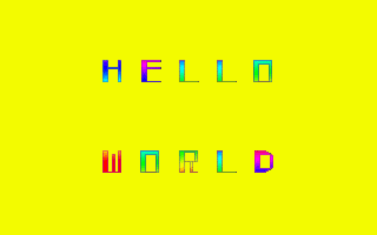
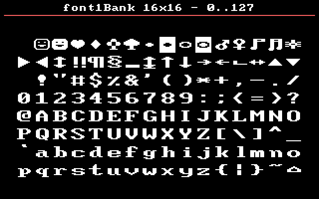
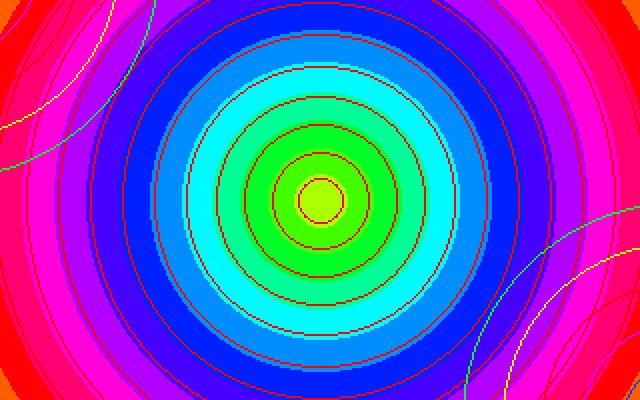
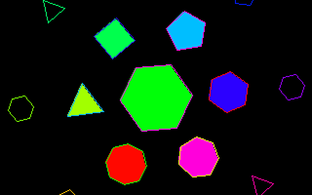

# DOS Graphics & Audio Engine (32 bits)

Moteur graphique et audio pour **DOS**, écrit en C ANSI avec **Open Watcom 1.9**, mode VGA **13h** (320×200, 256 couleurs) et carte **Sound Blaster** (ou compatible), en modèle mémoire **flat 32 bits** (DOS/32A).

Accès direct au matériel PC (VRAM, PIT, clavier, DMA/DSP), sans dépendance à une bibliothèque graphique ou audio tierce. Une playlist de 9 scènes de démonstration (`scenes/`) illustre l'ensemble des modules : palette, polices bitmap, primitives 2D, rotozoom, musique tracker S3M...

<p align="center">
  
  
</p>
<p align="center">
  
  
</p>

---

## Sommaire

- [Fonctionnalités](#fonctionnalités)
- [Structure du dépôt](#structure-du-dépôt)
- [Modules](#modules)
- [Prérequis](#prérequis)
- [Compilation](#compilation)
- [Exécution](#exécution)
- [Exemple minimal](#exemple-minimal)
- [Scènes de démonstration](#scènes-de-démonstration)
- [Outils annexes (OUTILS/)](#outils-annexes-outils)
- [Limites connues](#limites-connues)
- [Licence](#licence)
- [Remerciements](#remerciements)

---

## Fonctionnalités

- **Vidéo** — mode 13h, double buffering (backbuffer RAM + `flip()`), synchronisation sur le retrace vertical.
- **Palette VGA** — chargement/sauvegarde `.pal`, interpolation (fade), cycle de couleurs, générateurs procéduraux (niveaux de gris, rouge/vert/bleu, arc-en-ciel HSV).
- **Primitives 2D** — pixel, ligne (Bresenham + clipping Cohen-Sutherland), rectangle, polygone (contour et remplissage scanline), cercle (Bresenham / mid-point).
- **Images & sprites** — chargement `.raw`/`.pal` en un coup (fonds d'écran, écrans fixes) ou préchargés en RAM pour un blit sans accès disque par frame, transparence par *color key*, feuilles de sprites.
- **Texte bitmap** — `font1` (glyphes ROM BIOS ou personnels, 8×8/8×16/16×16, accents français CP850) et `font2` (rendu par feuille de sprites).
- **Timer haute résolution** — reprogrammation du PIT à 70 Hz, avec chaînage vers l'ISR BIOS d'origine pour ne pas casser l'horloge DOS.
- **Clavier** — détection bas niveau de la touche Échap via l'interruption 09h.
- **Audio** — pilote Sound Blaster bas niveau (détection `BLASTER`, DSP, DMA en boucle auto-init sans clic), lecteur de modules **S3M** (vitesse, tempo, volumes, glissements, portamento, vibrato, arpège, offset) et mixeur d'effets **WAV** (8/16 bits, mono/stéréo, rééchantillonnage à la volée), mixage effectué hors interruption.
- **Gestionnaire de scènes** — chaque scène gère son propre minutage et signale sa fin ; l'enchaînement (playlist, bouclage) est décidé par `main.c`.

## Structure du dépôt

```
DOS_Graphics_and_Audio_Engine-32bit/
├── main.c              Point d'entrée, boucle principale, arrêt propre
├── app.h                Flags globaux (quitRequested)
│
├── video.c / video.h     Mode 13h, backbuffer, retrace vertical
├── palette.c / palette.h Palette VGA (DAC), fade, cycle, générateurs
├── graphics.c / graphics.h  Primitives 2D (ligne, rectangle, polygone, cercle)
├── image.c / image.h     Chargement one-shot d'images .raw/.pal
├── sprite.c / sprite.h   Sprites préchargés en RAM, feuilles de sprites
├── font1.c / font1.h     Texte bitmap (BIOS ou police personnelle)
├── font2.c / font2.h     Texte par feuille de sprites
│
├── timer.c / timer.h     Timer PIT haute résolution (70 Hz)
├── keyboard.c / keyboard.h  Détection Échap (INT 09h)
│
├── audio.c / audio.h     Orchestrateur audio (musique + effets)
├── sblaster.c / sblaster.h  Pilote bas niveau Sound Blaster (DSP + DMA)
├── s3m.c / s3m.h         Lecteur de modules musicaux .s3m
├── wav.c / wav.h         Chargement et mixage d'effets .wav
│
├── scene.c / scene.h     Gestionnaire de scènes (playlist, transitions)
├── scenes/               9 scènes de démonstration (scene0.c … scene8.c)
│
├── font1/                Données des polices bitmap personnelles
├── font2/                Feuilles de sprites de police + palettes
├── images/               Images de démo (.raw/.pal) et palettes de test
├── audios/               Musique de démo (musique.s3m)
├── CAPTURES/             Captures d'écran de la démo
│
├── OUTILS/               Scripts Python de conversion d'assets
│
├── BUILD.BAT             Compilation (wcc386 + wlink)
├── CLEAN.BAT / CLEANALL.BAT  Nettoyage des fichiers générés
├── LINK.RSP              Script d'édition de liens (DOS/32A)
└── LICENSE               GNU GPL v3
```

## Modules

| Module | Rôle | Dépend de |
|---|---|---|
| `video` | Backbuffer, mode vidéo, retrace vertical | — |
| `palette` | Palette VGA (DAC), fade, cycle | `video` |
| `graphics` | Primitives de dessin 2D | `video` |
| `image` | Chargement one-shot d'images | `video`, `palette` |
| `sprite` | Sprites préchargés, feuilles de sprites | `video` |
| `font1` | Texte bitmap multi-tailles | `video`, `graphics` |
| `font2` | Texte par feuille de sprites | `video` |
| `timer` | Timer PIT 70 Hz | — |
| `keyboard` | Détection Échap | `app` |
| `sblaster` | Pilote DSP + DMA Sound Blaster | — |
| `s3m` | Lecteur de modules musicaux | — |
| `wav` | Mixeur d'effets sonores | — |
| `audio` | Orchestrateur audio | `sblaster`, `s3m`, `wav` |
| `scene` | Enchaînement des scènes | `timer` |

Chaque `.h` documente en tête de fichier le format de données et les conventions d'usage du module correspondant.

## Prérequis

- **[Open Watcom 1.9](http://www.openwatcom.org/)** (`wcc386` + `wlink`), seule chaîne de compilation testée.
- **[DOS/32A](http://sourceforge.net/projects/dos32a/)** (`DOS32A.EXE` + `STUB32A.EXE`), à côté de `demo.exe` (ou dans le `PATH`) au lancement.
- Un PC réel (386 ou plus) avec carte VGA, ou un émulateur DOS : [DOSBox](https://www.dosbox.com/), [DOSBox-X](https://dosbox-x.com/), [86Box](https://86box.net/).
- Pour le son : carte **Sound Blaster** (ou compatible) configurée via la variable d'environnement `BLASTER` (ex. `SET BLASTER=A220 I5 D1 H5 P330 T6`). En son absence, le moteur audio se désactive proprement.
- Python 3 + Pillow, uniquement pour les scripts de `OUTILS/` (facultatif pour compiler/exécuter la démo).

## Compilation

```bat
BUILD.BAT
```

Compile chaque module avec `wcc386 -3s -mf -os -I.` (instructions 386, modèle flat, optimisation taille), puis lie via `wlink @LINK.RSP` pour produire `demo.exe`.

```bat
CLEAN.BAT       REM supprime .obj / .out / .err
CLEANALL.BAT    REM idem + supprime aussi demo.exe
```

> `LINK.RSP` explicite les directives DOS/32A (format `OS2 LE`, stub `stub32a.exe`). Si votre installation Watcom reconnaît déjà le système `STUB32A`, `LINK.RSP` peut être réduit à la ligne `SYSTEM STUB32A`.

## Exécution

```bat
demo.exe
```

Boucle jusqu'à **Échap**.

## Exemple minimal

```c
#include "video.h"
#include "palette.h"
#include "graphics.h"
#include "timer.h"
#include "keyboard.h"
#include "app.h"

int main(void)
{
    initBackbuffer();
    setVideoMode(0x13);
    installTimer();
    installKeyboard();

    while (!quitRequested)
    {
        clearScreen(0);
        drawCircleFill(160, 100, 40, 12);
        drawRect(10, 10, 309, 189, 15);
        flip();
    }

    restoreKeyboard();
    restoreTimer();
    setVideoMode(0x03);
    freeBackbuffer();
    return 0;
}
```

## Scènes de démonstration

| # | Scène | Contenu |
|---|---|---|
| 0 | `scene0.c` | Écran noir (1 s, calage des captures vidéo) |
| 1 | `scene1.c` | Pixels aléatoires (LCG) avec fondu d'entrée/sortie |
| 2 | `scene2.c` | Palette VGA : cycle de couleurs, interpolation (lerp) |
| 3 | `scene3.c` | Polices `font1` : BIOS et personnelles, 8×8/8×16/16×16 |
| 4 | `scene4.c` | Texte via `font2` (feuille de sprites) |
| 5 | `scene5.c` | Scrolling de texte, horizontal puis vertical |
| 6 | `scene6.c` | Rotozoom (rotation + zoom) sur une image 256×256 |
| 7 | `scene7.c` | Tunnel, plasma, flocon de Koch, rebond de polygones |
| 8 | `scene8.c` | Cycle de vie audio : `playMusic` → `fadeMusicIn` → lecture → `fadeMusicOut` → `stopMusic` |

Ordre et bouclage définis par le tableau `playlist[]` dans `main.c`.

## Outils annexes (OUTILS/)

- **`vgatool.py`** — convertit une image en `.raw` + `.pal`, ou visualise une palette existante.
- **`gen_palettes.py`** — régénère les fichiers `.pal` procéduraux du projet et leurs aperçus PNG à partir des fonctions `build...Palette()` de `palette.c`.
- **`fonts/`** — conversion de polices TrueType, PNG ou PSF vers le format `Font1Bank` (`ttf2c.py`, `png2c.py`, `psf2c.py`).
- **`DUMPPAL.C`** — inspection du contenu d'un fichier `.pal`.

## Limites connues

- Mode 13h uniquement (320×200, 256 couleurs).
- Lecteur S3M partiel : vitesse, tempo, sauts, volume, glissements de volume, portamento (par pas et tone portamento), vibrato, arpège et offset sont supportés ; tremolo, tremor, retrig et panning sont ignorés (la note se déclenche quand même) ; voir l'en-tête de `s3m.h` pour le détail exact.
- Jusqu'à `S3M_MAX_CHANNELS` (16) voies mixées et `WAV_MAX_VOICES` (4) effets simultanés.
- Testé uniquement avec Open Watcom 1.9 + DOS/32A.

## Licence

GNU GPL v3 — voir [`LICENSE`](LICENSE).

## Remerciements

`audios/musique.s3m` (*Starshine*) est emprunté à **Purple Motion** (Jonne Valtonen) de **Future Crew** — voir `audios/readme.txt`.
